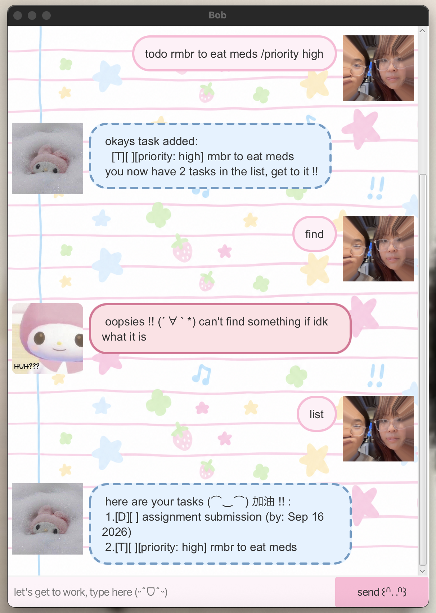

# Bob User Guide

Bob is a desktop chatbot for managing tasks using simple typed commands.

## Quick Start

Type a command in the text box and press **Enter** or click **send**. Bob automatically saves task changes between sessions.

Use lowercase command words. Bob accepts extra spaces at the start, end, or between words and saves task descriptions with single spaces. Replace the uppercase placeholders below with your own details. For `TASK_NUMBER`, use the number shown by `list` or `find` (starting at 1); numbers can change after deleting a task.

## Features

### View tasks

Shows all your tasks and their completion status.

**Command:** `list`

### Add a todo

Adds a task without a date or time.

**Format:** `todo DESCRIPTION`

**Example:** `todo read book`

### Add a deadline

Adds a task due on a date in `YYYY-MM-DD` format.

**Format:** `deadline DESCRIPTION /by DATE`

**Example:** `deadline submit report /by 2026-09-20`

### Add an event

Adds an event with start and end times in `YYYY-MM-DD HHmm` format (24-hour time, no colon). The end may be at the same time as the start or later.

**Format:** `event DESCRIPTION /from START /to END`

**Example:** `event meeting /from 2026-09-20 1400 /to 2026-09-20 1600`

### Mark / unmark a task

Marks a task as completed or incomplete.

**Commands:** `mark TASK_NUMBER` / `unmark TASK_NUMBER`

**Examples:** `mark 2` / `unmark 2`

### Delete a task

Deletes a task.

**Command:** `delete TASK_NUMBER`

**Example:** `delete 2`

### Find tasks

Finds tasks whose descriptions contain the given text (case-sensitive), keeping their full-list task numbers.

**Command:** `find KEYWORD`

**Example:** `find book`

### Say goodbye

Displays a farewell and exits Bob. In the desktop app, the window closes after a short pause so you can read the farewell.

**Command:** `bye`

## Optional Priorities

Todos, deadlines, and events accept `low`, `moderate`, `high`, or `none` (lowercase); omitting the priority or using `none` leaves the task untagged.

**Format:** Append `/priority PRIORITY` once at the end of the task command.

**Examples:**

- `todo read book /priority high`
- `deadline submit report /by 2026-09-20 /priority moderate`
